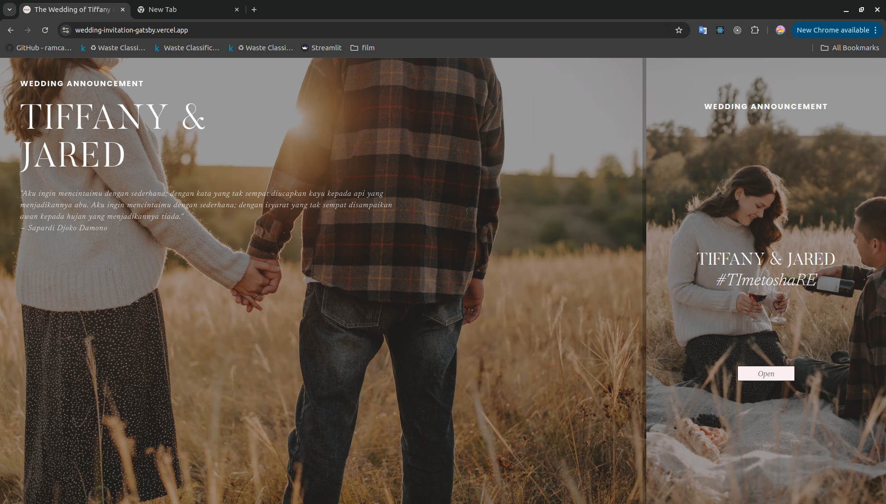
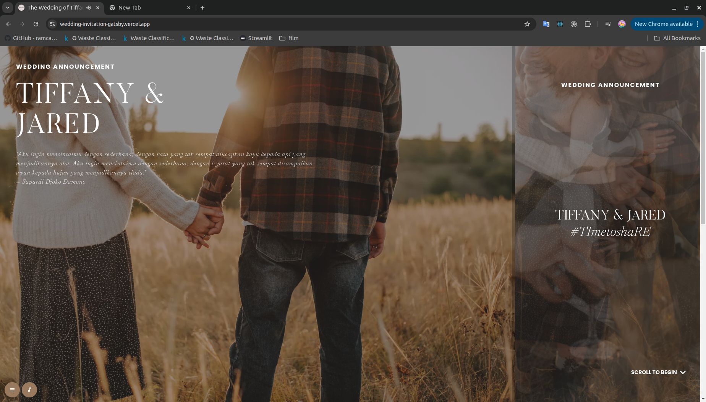
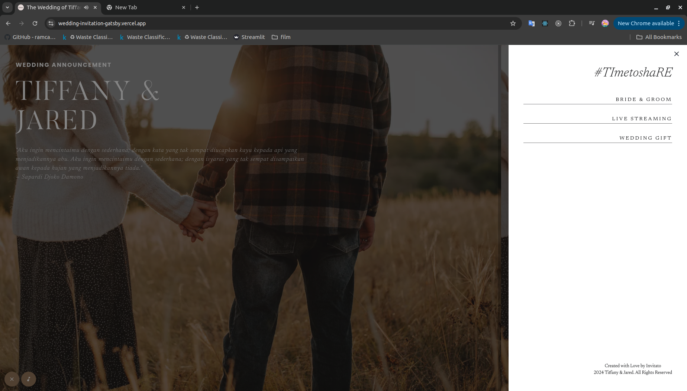
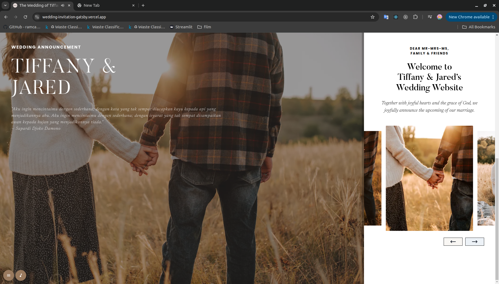

<h1 align="center">
  Wedding Invitation Gatsby
</h1>

A modern and elegant wedding invitation website built with Gatsby.

## 🚀 Quick start

1.  **Install Gatsby CLI.**

    To run this project locally, first install the Gatsby CLI by running the following command:

    ```shell
    npm install -g gatsby-cli
    ```

2.  **Clone the repository.**

    Clone this repository to your local machine:

    ```shell
    git clone https://github.com/Josegrd/wedding-invitation-gatsby.git
    cd wedding-invitation-gatsby
    ```

3.  **Install dependencies.**

    Run the following command to install the required dependencies:

    ```shell
    npm install
    ```

4.  **Start the development server.**

    Run the following command to start the development server:

    ```shell
    gatsby develop
    ```

    After this, your site will be available at `http://localhost:8000`.

5.  **Open the source code and start editing!**

    Open the `wedding-invitation-gatsby` directory in your preferred code editor and begin editing the source code to customize your wedding invitation.

## 🌐 Live Demo

You can check out the live demo of this project here:

[Wedding Invitation - Live Demo](https://wedding-invitation-gatsby.vercel.app/)


## 💾 Preview
1.  **Home**


2.  **Home - Tablet Mode**


3.  **Welcome**


4.  **Navigation**


5.  **Galery**


6.  **Galery - Detail**


## 🛠️ Technologies Used
- Gatsby: A static site generator that powers fast, optimized websites.
- Chakra UI: A simple, modular, and accessible component library that helps build responsive websites with ease.

## 💫 Deployment
The project is deployed on Vercel. To deploy your own project on Vercel:

  1. Push your code to a GitHub repository.
  2. Go to Vercel.
  3. Sign in or create an account.
  4. Click on "Add New" -> "Project" and link your Github repository
  5. Follow the prompt and waiting to deploy your site

## 📄 Notes

 ### For Question Contact me :
 1. **Twitter/X : @jsgrd8**
 2. **or contact from here**
